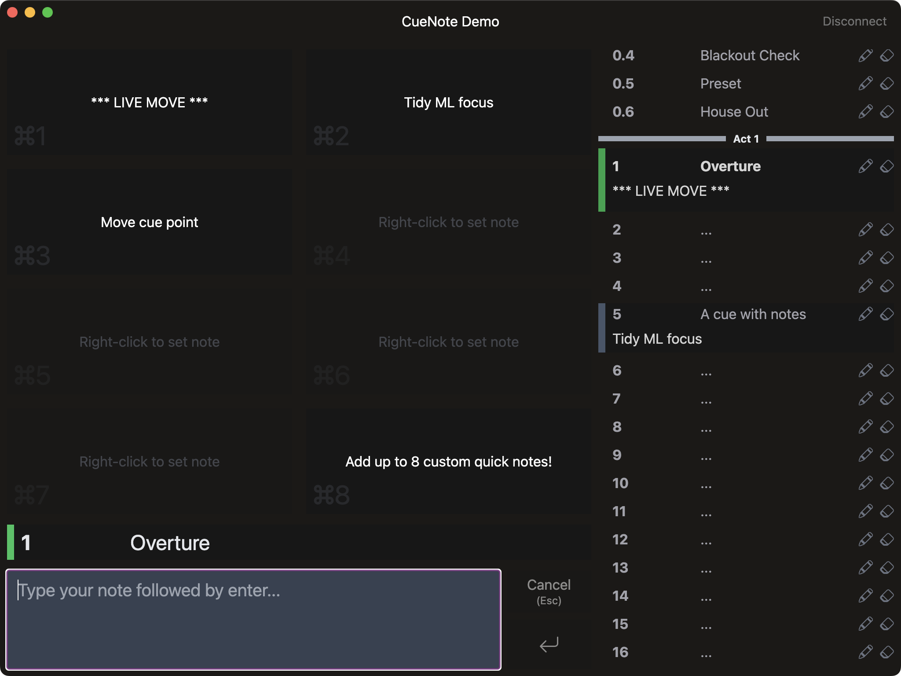

<h1 align="center">CueNote</h1>
  <p align="center">
    Note-taking utility for ETC Eos Family lighting consoles
    <br />
    <br />
    <a href="https://github.com/douglasfinlay/cue-note/issues/new?template=bug-report.md">Report Bug</a>
    ·
    <a href="https://github.com/douglasfinlay/cue-note/issues/new?template=feature-request.md">Request Feature</a>
  </p>
</div>



> **Warning**  
> This project is under active development and breaking changes are likely. Use
> at your own risk!

## About

CueNote is a desktop utility to remotely add and edit notes in an Eos show file.

## Getting Started

### Prebuilt Binary

CueNote is available for Windows and macOS. Download the latest binary for your platform from the [Releases](https://github.com/douglasfinlay/cue-note/releases) page.

### Building from Source

#### Prerequisites

- [Node.js 16+](https://nodejs.org/en)
- [Yarn](https://yarnpkg.com)

#### Steps

1. Clone this repository

   ```sh
   git clone git@github.com:douglasfinlay/cue-note.git
   ```

2. Install dependencies

   ```sh
   yarn
   ```

3. Run

   ```sh
   yarn start
   ```

## Usage

Connect to an Eos console via IP address or hostname. Please ensure _Third Party OSC_ is enabled.

### Quick Note Buttons

Right-click on a quick note button to change its text. This will automatically
be saved to your local machine without modifying the Eos show file.

## Roadmap

- [x] Quick note in-place edit
- [x] Quick note keyboard shortcuts
- [ ] Styling overhaul
- [ ] Button to filter cue list to noted cues only
- [ ] Auto-reconnect after connection loss
- [ ] Resync when a different show file is loaded
- [ ] Move Eos/OSC functionality into a separate library ([node-eos-console](https://github.com/douglasfinlay/node-eos-console))

## Contributing

All contributions are greatly appreciated. Please feel free to [open issues](https://github.com/douglasfinlay/cue-note/issues/new/choose) to help this project develop.

## License

CueNote is licensed under the MIT license. See [`LICENSE`](https://github.com/douglasfinlay/cue-note/blob/main/LICENSE) for details.

## Disclaimer

This project is in no way affiliated with [ETC](https://www.etcconnect.com/).
